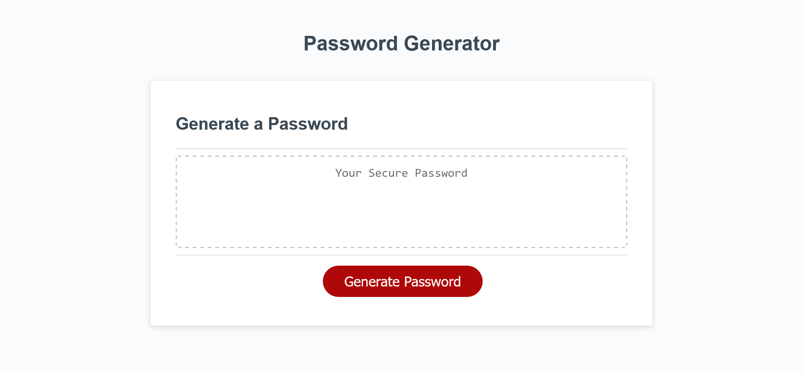

# JavaScript Password Generator

## Description

This code creates an application that enables the user to generate random passwords based on criteria that they’ve selected. This app will run in the browser and will feature dynamically updated HTML and CSS powered by JavaScript code.

The password can include special characters. If you’re unfamiliar with these, see this [list of password special characters](https://www.owasp.org/index.php/Password_special_characters) from the OWASP Foundation.

## Functionality

```
WHEN I click the button to generate a password
THEN I am presented with a series of prompts for password criteria
WHEN prompted for password criteria
THEN I select which criteria to include in the password
WHEN prompted for the length of the password
THEN I choose a length of at least 8 characters and no more than 128 characters
WHEN asked for character types to include in the password
THEN I confirm whether or not to include lowercase, uppercase, numeric, and/or special characters
WHEN I answer each prompt
THEN my input should be validated and at least one character type should be selected
WHEN all prompts are answered
THEN a password is generated that matches the selected criteria
WHEN the password is generated
THEN the password is written to the page
WHEN I click the password on the page
THEN it is selected all at once so I can copy it to the clipboard
```

## Mock-Up

The following image shows the web application's appearance and functionality:



## Sources

There is some non-original code in this project:

* Code skeleton for this project (including [style.css](style.css) and [index.html](index.html) and the bulk of [script.js](script.js)) were provided by the UCLA Coding Bootcamp as "starter code."
* The random string generation algorithm was based on [this StackOverflow thread](https://stackoverflow.com/questions/1349404/generate-random-string-characters-in-javascript) (specifically, code written by a user named "Code_Worm") and is used in the generatePassword() function in [script.js](script.js).  Code was modified by me to better fit this project, but their basic functionality (a while-loop appending characters randomly chosen from a string) is intact.
* The code to select the whole password on click was obtained from [this StackOverflow thread](https://stackoverflow.com/questions/7313786/highlight-all-text-in-textarea) and was written by a user named "Ignacio Ara."  It is used in the [index.html](index.html) file.
* The list of special characters comes from [OWASP](https://www.owasp.org/index.php/Password_special_characters), listed above.  I looked up how to do escape characters [on StackOverflow](https://stackoverflow.com/questions/10055773/double-quote-in-javascript-string) (as I wasn't sure of the proper syntax in JavaScript).  As it turned out, the syntax is the same as in C++!

## Please Note

While researching random string generation online, it was noted that the functionality I am using (see Sources, above) is not cryptographically secure.  I considered it an acceptable risk for this project (a proof-of-concept demonstration page) at this time (July 5, 2023), but may revise the code to be cryptographically secure at a later date.
- - -
Written by Giancarlo Whitaker, 2023